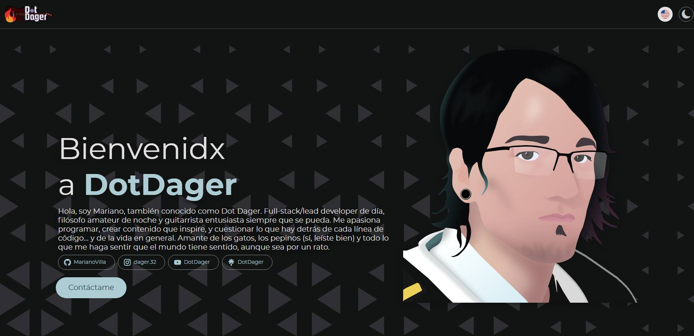

# DotDager Landing Page

El 21/11/2024 el YouTuber Mariano Villa también conocido como DotDager lanzó un concurso para realizar una landing page/portfolio personal.

Estas fueron las indicaciones de lo que pidió:

>Hi X,
>
>I’m looking to have a clean and simple landing page/portfolio created
>my personal brand, called "Dot Dager".
>
>The page should showcase my name, a profile picture (attached), and
>give visitors a sense of my personality; like a portfolio or
>introduction page. Here’s a bit about me: I’m a content creator who
>loves programming, cats, guitars, pickles, and philosophy.
>
>I don’t have specific design requirements beyond featuring my name and
>profile picture prominently, but I’d love to see something that feels
>like “me.” You can get creative with how you represent these
>interests.
>
>The site can be single-page, doesn't require any navigation nor
>complex features (like content uploads).
>
>Attached is my profile pic, which I use in all my socials. Aside from
>this, branding and palette are to your liking.
>
>I have a $n budget and expect to get this done in about a week.
>
>Would this be something you'd be interested in helping me with?
>
>Best, Mariano/Dot Dager.

Adicionalmente comentó que sería genial incluir un easter-egg a LumberJack (conseguido haciendo click en el interés de pepinos).

Esta es mi propuesta de landing page, mantiene un tono semi-serio, haciendo pequeños chistes en varios lugares pero conservando seriedad en los pocos lugares en los que se necesita.

Esta página fué hecha con [GUSI Framework v3](https://github.com/Expringsoft/GUSI-Framework-3/) como framework backend, utiliza [Bootstrap 5](https://getbootstrap.com/docs/5.3/getting-started/introduction/) y [Material Web Components](https://github.com/material-components/material-web), el resto es CSS/HTML puro como campeón.

Las ilustraciones personalizadas son creadas por mí con Figma. La página se encuentra disponible en Inglés y Español (es-419), localización gestionada por el framework.

Live preview: https://previews.expringsoft.com/dotdager/